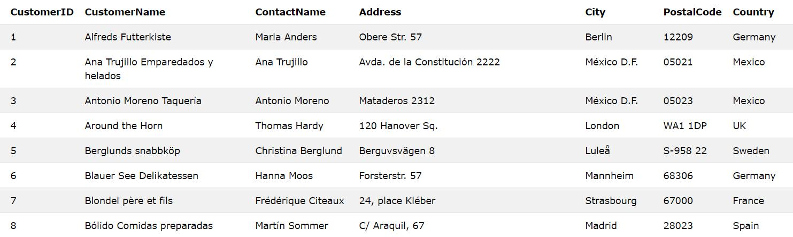
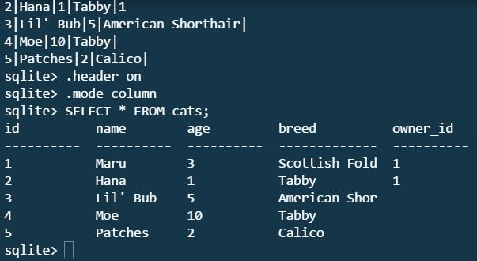

# Entry 1: SQL Basic 
### Overview: 
<p>In the last unit of Software Engineering Class, I was asked to conduct an independent study on any topics I want. The independent study will last for 9 weeks and I will submit an entry each week to record what I have learned in that week. Since I just finished the Ruby unit, I decided to continue learning something related to Ruby, which is databases. When I started to reserach about databases, I came across two types of probleming languages that help manage data in an organized way, SQL and Activerecord. I will learn about Activerecord next week, but bascially Activerecord allows user to write cleaner code without writing the long SQL syntax. However, I decided to learn the basic syntex for SQL because SQL is the foundation for Activerecord so that learning SQL will give me a better understaanding when I start learning Activerecord. </p>

### What is SQL?
SQL stands for Structured Query Language. It was created in the early 1970s by Donald D. Chamberlin and Raymond F. Boyce, who were part of the (IBM). Basically, SQL is a programming language that allows user to access, manipulate and store data in the database. Within the databases, the user can also create, delete and motify the data, which is commonly presented in a table form. 

### What is table?
<p>Have you ever wondered how the computer keep track of your data or how Facebook manage millions of user data? The answer is probably table. For most cases, we will be using Relational Databases for this unit because of its structure. Relational Databases is very simple, it consists of one or more table and each table is made out of row(s) and column(s). An example is the "Customers" table below.  </p>


Table is such an important and helpful tool for programmer especially when you want to keep track of data using rows and columns. Personally, my goal for the final project is to be able to take in user's data and store in in the table so that the user itself can look at it at the end. 
### Common commands for SQL
Before begin explaining what each commands can do, below is a list of major SQL commands that you will use to access, motify and manage your databases. 

- SELECT
- UPDATE
- DELETE
- INSERT
- WHERE

One thing that SQL is different from Ruby is the fact that all SQL commands are typed on the command line rather than in a document. I got very confused at first because I didn't know where to enter the commands. After experimenting with the code, I figured out that everything including creating a table and inserting data is done on the command line. <a href="https://github.com/learn-co-students/sql-queries-basic-v-000">Clink here to learn how to create a table</a>

##### SELECT: <br>
While I was going through different SQL tutorials, I realized that all tutorials always start with the SELECT command because that is how you can view your table. The SELECT command is by far the most important command for SQL because it is how you will get access to the data in the databases. In order to select an specific data from the databases, the code is 
`SELECT * FROM table_name;` <br><br>
Below is the result for the SELECT command:




`SELECT` is very helpful if you want to take a look of your table to make sure everything is at where they supposed to be. 
##### UPDATE:
The UPDATE command is used when you want to replace old information in your data with new values. <br>
```
UPDATE table_name
SET column1 = value1, column2 = value2, ...
WHERE condition;
```
##### DELETE:
The DELETE command is used to delete specific data from the existing table.
```
DELETE FROM table_name
WHERE condition;
```
##### INSERT: <br>
The INSERT command is used to add new information to your table. The way you have to do is to start with INSERT INTO and specify the name of your table and the column the information will be added, then use VALUES and specify the new informations you want to add. Remember, the column and new value need to be into the same order!
```
INSERT INTO table_name (column1, column2, column3, ...)
VALUES (value1, value2, value3, ...);
```
PS: The main difference between insert and update is that update will replace old information with new info, whereas insert will just add new information to the existing table. 
##### WHERE: <br>
If you want to select specific data in a particular table, you can use the WHERE command to fiter out certain information. It acts like a conditional statement. 
 
``` json
SELECT column1, column2, ...
FROM table_name
WHERE condition; 
```
In addition, you can use `AND` and `OR` if you want to include more conditions.


For this entry, I only went over the basic SQL commands that I think is important to know. SQL has way more functionality that you expected and you can do things like `ORDER BY`, `NULL` to organize your table the way you wanted to be. 
<br>
So at this point of learning, I personally feel like SQL is actually easier than I imagined. Similar to Ruby, the syntax for SQL does exactly what it looks like. If you want to delete something, you will have to the DELETE command and so on. 
 

#### Takeaways:
1. The best way to learn SQL is to create a simple table on your terminal. I started by only reading the documentations and it was confusing because I could not picture the table on my head. So, make a table and add some rows and columns of anything you want. 
2. Learn the basic first before making something very complicated. Once you know how to make a simple table, the rest will be very easy. But if you don't even know how to create a table, you will never know how to add data into the table. Don't rush, be patient!
3. Go through at least 2 to 3 documentations first before sticking to one because some tutorials can be more complex than the others. 
4. All commands start with uppercase!
5. Always use `SELECT * FROM table_name;` to make sure you type in the correct comands. Treat it as a git status command to keep track of your data. 