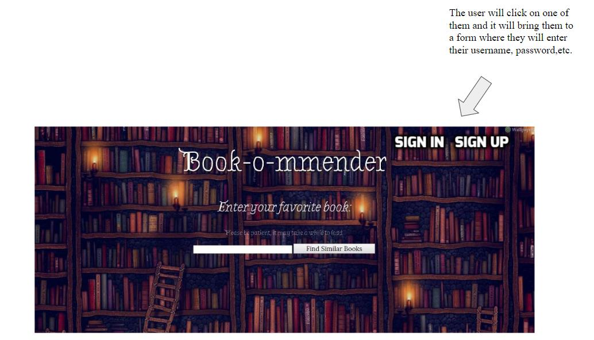
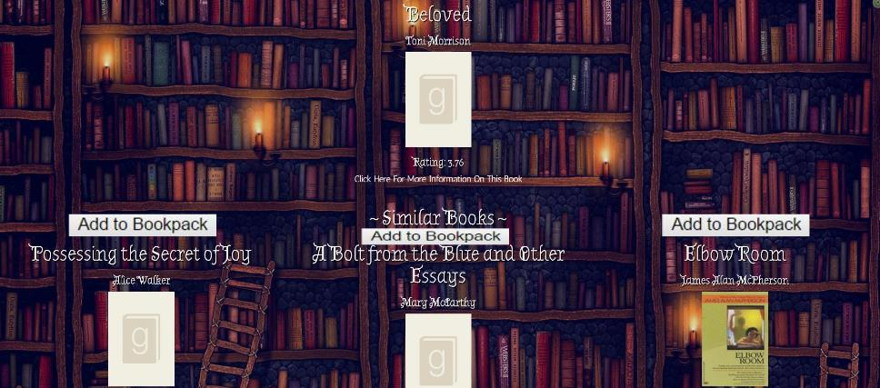

# Entry 6: New Project Idea

### Overviews: 

While I was working on my project last week, I did successfully let the user enter a question and display that on the home page. However, I changed my mind and decided to add on to my previous API project, Book-o-mmended. The reason why I changed my mind was because I really do think the Book-o-mmender is a helpful app for people who like to read and I simply want to make it better. Since I am learning about ActiveRecord and how to use table to manipulative data, I can add a user account functionality to the website. After talking to my group mates, which both of them are responsible for the front-end, we decided to let the user to create an account and let them to save the book they like to their wish list just like a shopping cart. I will be responsible for the backend such as making the user account and letting the user to save the book to another page. 

Since I changed my project idea this week, I had to start my migration and tables again. What I did this week was setting up the tables for user and the book and lots of brainstorming of what I need to do to make my ideas to work. Also, I made a layout of what the website will look like at the end. 

##### New functionality that I need to add on the website:
- A signin and signup pages for the user to enter its username and password. This page is important because I will use the user's information to recrive its information such as the books they like in this case. <br>
I already coded this part and the code is below:
```
class CreateUsers < ActiveRecord::Migration
  def up
    create_table :users do |t|
      t.string :name
      t.string :password
    end
  end

  def down
    drop_table :users
  end
end
```
```
class CreateBooks < ActiveRecord::Migration
   def up
    create_table :books do |t|
      t.string :name
      t.string :image
      t.string :author

    end
  end

  def down
    drop_table :books
  end
end
```
Below is the form for the sign up page: 
```
  <form action="/sign_up" method="POST">
        <input type="text" placeholder="username" name="name">
        <br>
        <input type="password" placeholder="password" name="password">
        <br>
        <input type="submit" value="Sign Up">
    </form>
```
- A button for each book that let user to click and save that book to a new page. 
- A new page that will include all the user favorite books with image, book name and author. Even though I am 100% sure how I am going to achieve this, I do have some thoughts. My idea is that I will assign each book with an id and when the user click on "add to favorite", the id of that book will be stored into an array. Then I will iterate this array and display the image, book name and author of all the book. I do know that each user will have its own session id for the signin and logut purposes, I am thinking to use the same method for the book. My current problem is not knowing how to assign an id for each book and that will be my main task for this project.


#### What I expected to see: 




### Takeaways:
1. Google example code if you are stuck on something. I am asking you to copy and paste the code, I am asking you to learn from the example code and apply that knowledge onto your own project. I personally got stuck on the buttom part and how to add a book into a new page, so I did some googling and found a person who did a project that involved with buttom and storing the information into the array. That was extremely helpful for me because I learned what kind of steps I need to take in order to store the item information.
2. Do have a picture or idea of what you expect your project to look like because that will save you some time and will motivate you while coding. After I knew that I will continue working on my previous project, I immediately went to google slide and did a layout of what the website should look like at the end. This way I know what component I will need to work on in the future. 

